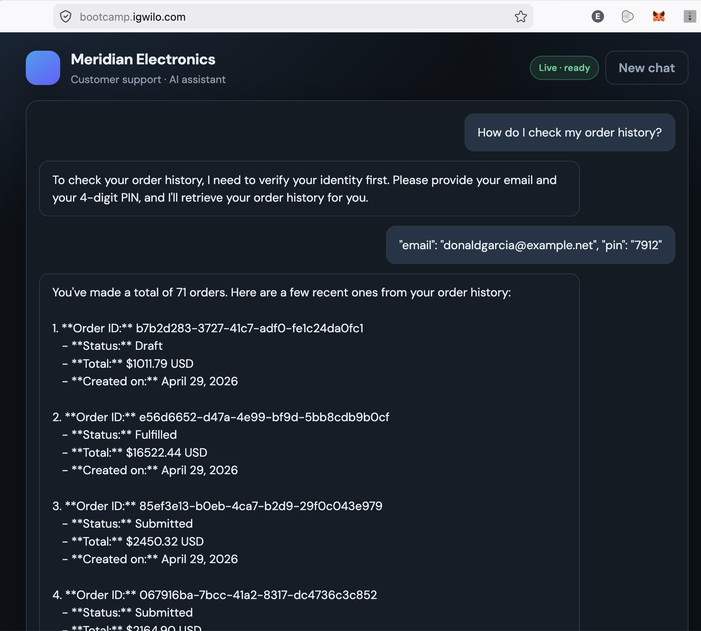
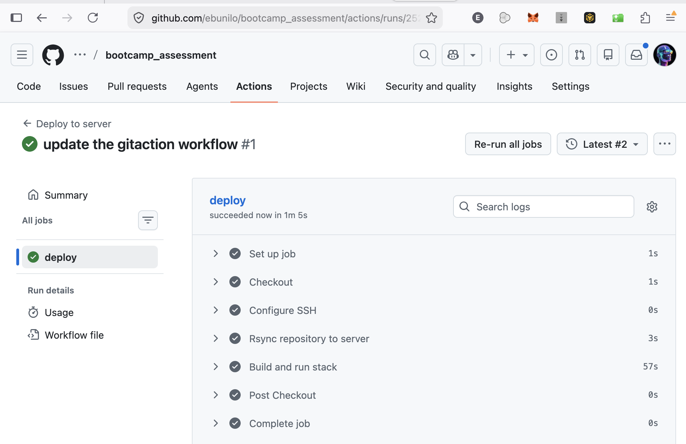

# Andela A3: AI Engineering Bootcamp Assessment

This project delivers a **Meridian Electronics** customer-support experience: a streaming web UI (**FastAPI** + **SSE**), **OpenAI** chat with tool calling, a remote **MCP** server for orders and catalog, **input guardrails**, optional **LangSmith** tracing, and **Docker** deployment.

## Documentation

Detailed guides live under [`documentation/`](documentation/README.md):

| Topic | Doc |
|--------|-----|
| Architecture & production path | [documentation/architecture.md](documentation/architecture.md) |
| MCP HTTP, `explore_mcp.py`, tools & test data | [documentation/mcp.md](documentation/mcp.md) |
| Input guardrails | [documentation/guardrails.md](documentation/guardrails.md) |
| Uvicorn, Docker, Compose, VPS layout | [documentation/docker.md](documentation/docker.md) |
| Pytest suites | [documentation/tests.md](documentation/tests.md) |
| LangSmith / tracing | [documentation/observability.md](documentation/observability.md) |

**Quick start:** from `bootcamp_assessment`, run `python3 -m uvicorn web_app:app --reload --host 0.0.0.0 --port 9100`. Docker and env vars are described in [documentation/docker.md](documentation/docker.md) and [`web_app.py`](web_app.py).

## Demo & screenshots

### Video

### Deployed app

### Check Order History
Check order history using email address and pin

### Guardrails (manual test)

### Monitoring (LangSmith)

### Automated Deplpoyment via Gitaction

