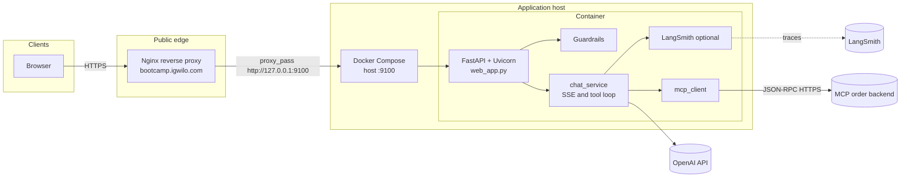

# Architecture

High-level view of the Meridian Electronics customer-support stack.

## Layers

| Layer | Role |
|--------|------|
| **Client** | Browser loads the static UI (`static/`), calls JSON APIs and **SSE** (`/api/chat/stream`) on the same origin as the app (or via the proxy host name). |
| **Reverse proxy** | **Nginx** terminates TLS and routes **`https://bootcamp.igwilo.com`** to the app upstream (e.g. `http://127.0.0.1:9100` on the host where Docker publishes the container port). |
| **Application container** | **Uvicorn** runs **`web_app:app`**: session handling, **input guardrails**, OpenAI chat + streaming, MCP JSON-RPC over HTTPS ([`mcp_client.py`](../mcp_client.py)), optional LangSmith ([`observability.py`](../observability.py)). |
| **OpenAI** | Chat completions (tools / streaming) using `OPENAI_API_KEY`. |
| **MCP backend** | Remote **Streamable HTTP** MCP (`MCP_URL`): catalog, auth, orders (`initialize`, `tools/list`, `tools/call`). |
| **LangSmith** (optional) | Traces LLM and tool spans — see [Observability](observability.md). |

## Diagram

## Production traffic path

Traffic hits **`https://bootcamp.igwilo.com`** → **Nginx** → Docker-published **Meridian app** on **9100**.

Configure Nginx `server_name bootcamp.igwilo.com`, TLS certificates, and `proxy_pass` with settings suitable for **SSE** (e.g. disable buffering for the chat stream path if responses stall).

## Related code

| Area | Entry points |
|------|----------------|
| HTTP API + static | [`web_app.py`](../web_app.py) |
| Agent loop (sync + SSE) | [`chat_service.py`](../chat_service.py) |
| MCP HTTP client | [`mcp_client.py`](../mcp_client.py) |

- [Guardrails](guardrails.md) · [MCP & tools](mcp.md) · [Docker](docker.md) · [Tests](tests.md)
